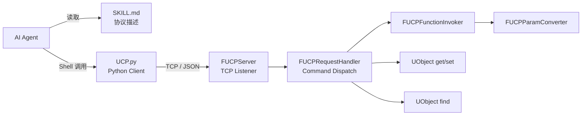
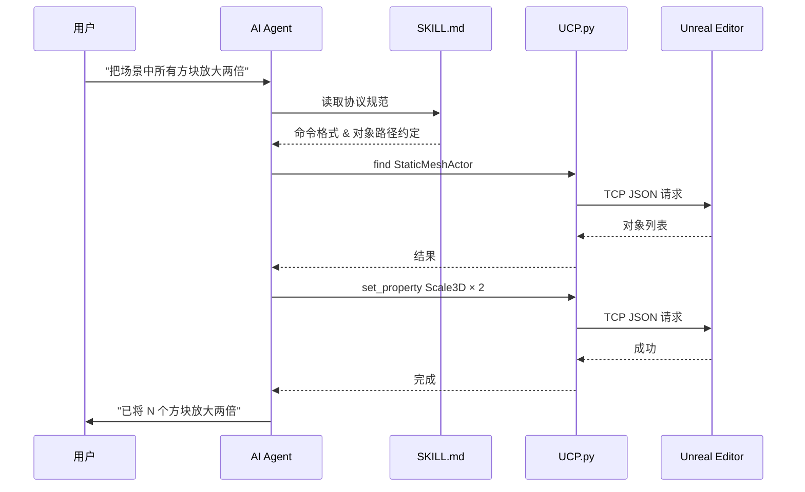

<p align="center">
  <h1 align="center">UnrealClientProtocol</h1>
  <p align="center">
    <strong>给你的 AI Agent 一双伸进 Unreal Engine 的手。</strong>
  </p>
  <p align="center">
    <a href="LICENSE"></a>
    <a href="https://www.unrealengine.com/"></a>
    <a href="https://www.python.org/"></a>
    <a href="#3-配置-agent-skill"></a>
    <a href="README.md"></a>
  </p>
</p>

---

UnrealClientProtocol（UCP）提供原子化的客户端通信协议，它的核心设计理念是：

- **不替 Agent 做决策，而是给它能力。**

传统的 UE 自动化方案往往需要为每个操作编写专门的接口或脚本。UCP 反其道而行——它只暴露引擎的原子能力（调用函数、读写属性、查找对象、元数据自省），然后信任 AI Agent 自身对 Unreal Engine API 的理解来组合这些原子操作，完成复杂任务。

这意味着：

- **你不需要预设"能做什么"。** Agent 能调用的不是一组有限的预定义命令，而是整个引擎反射系统暴露出的所有函数和属性，引擎能做的，Agent 就能做。
- **你可以用 Skills 来塑造 Agent 的行为。** 通过编写专属的 Skill 文件，你可以为特定工作流注入领域知识——关卡搭建的规范、资产命名的约定、材质参数的调优策略——Agent 会将这些知识与 UCP 协议结合，按照你定义的方式工作。
- **能力会随模型进化而增长。** UCP 的协议层是稳定的，而 Agent 的理解能力在持续提升。今天它可能需要 `describe` 来探索一个陌生的类，明天它也许已经了然于胸。你无需改动任何代码，就能享受到 AI 能力进步带来的红利。

我们相信，AI Agent + 原子化协议 + 领域 Skills 的组合，将从根本上改变开发者与 Unreal Engine 的交互方式。UCP 是这个愿景的第一步。

## 特性

- **零侵入** — 纯插件架构，不修改引擎源码，拖入 `Plugins/` 即可使用
- **反射驱动** — 基于 UE 原生反射系统，自动发现所有 `UFunction` 与 `UPROPERTY`
- **原子化协议** — 5 种命令覆盖 UObject 的查找、函数调用、属性读写、元数据自省
- **批量执行** — 支持单次请求发送多条命令，减少网络往返
- **编辑器集成** — `set_property` 命令自动纳入 Undo/Redo 系统
- **WorldContext 自动注入** — 无需手动传递 WorldContext 参数
- **安全可控** — 支持 Loopback 限制、类路径白名单、函数黑名单
- **开箱即用的 Python 客户端** — 附带轻量 CLI 脚本，一行命令即可与引擎对话
- **Agent Skills 集成** — 内置 Skill 描述文件（兼容 Cursor / Claude Code / OpenCode 等），AI Agent 可直接理解并使用协议

## 工作原理



## 快速开始

### 1. 安装插件

将 `UnrealClientProtocol` 文件夹复制到你的项目 `Plugins/` 目录下，重新启动编辑器编译即可。

### 2. 验证连接

编辑器启动后，插件会自动在 `127.0.0.1:9876` 上监听 TCP 连接。使用自带的 Python 客户端进行测试：

```bash
python Plugins/UnrealClientProtocol/Skills/unreal-client-protocol/scripts/UCP.py '{"type":"find","class":"/Script/Engine.World","limit":3}'
```

如果返回了 World 对象列表，说明一切就绪。

### 3. 配置 Agent Skill

插件在 [`Skills/unreal-client-protocol/`](./Skills/unreal-client-protocol/) 目录下附带了完整的 Skill 包（包含协议描述文件 `SKILL.md` 和 Python 客户端脚本 `scripts/UCP.py`）。将整个文件夹复制到你所使用的 AI 编码工具的 Skills 目录中，即可让 Agent 自动理解并使用 UCP 协议。

根据你使用的工具，将 `Skills/unreal-client-protocol/` **整个文件夹** 复制到对应目录：

| 工具 | 目标路径 |
|------|----------|
| **Cursor** | `.cursor/skills/unreal-client-protocol/` |
| **Claude Code** | `.claude/skills/unreal-client-protocol/` |
| **OpenCode** | `.opencode/skills/unreal-client-protocol/` |
| **其他** | 参照对应工具的 Agent Skills 规范放置 |

复制后的目录结构如下：

```
.cursor/skills/                          # 或 .claude/skills/ 等
└── unreal-client-protocol/
    ├── SKILL.md                         # 协议描述文件（Agent 自动读取）
    └── scripts/
        └── UCP.py                       # Python 客户端（Agent 通过 Shell 调用）
```

完成后，Agent 在接收到与 Unreal Engine 相关的指令时，会自动读取 SKILL.md 并通过 `scripts/UCP.py` 与编辑器通信。

> **工作流程**：用户发出指令 → Agent 识别并读取 SKILL.md → 根据协议构建 JSON 命令 → 通过 `UCP.py` 发送给编辑器 → 返回结果



### 4. 验证 Agent 功能

向 Agent 发出以下测试指令，确认 Skill 配置正确：

- **查询场景**："帮我看一下当前场景都有什么东西"
- **读取属性**："现在的太阳光对应真实世界的什么时间"
- **修改属性**："把时间更新到下午六点"
- **调用函数**："调用 GetPlatformUserName 看一下当前用户名"
- ...

如果 Agent 能够自动构建正确的 JSON 命令、调用 `UCP.py` 并返回结果，说明一切配置完成。

## 配置项

通过 **编辑器 → 项目设置 → 插件 → UCP** 进行配置：

| 设置 | 类型 | 默认值 | 说明 |
|------|------|--------|------|
| `bEnabled` | bool | `true` | 启用/禁用插件 |
| `Port` | int32 | `9876` | TCP 监听端口（1024–65535） |
| `bLoopbackOnly` | bool | `true` | 仅绑定 127.0.0.1 |
| `AllowedClassPrefixes` | TArray\<FString\> | 空 | 类路径白名单前缀，为空则不限制 |
| `BlockedFunctions` | TArray\<FString\> | 空 | 函数黑名单，支持 `ClassName::FunctionName` 格式 |


## 已知限制

- **Latent 函数**（包含 `FLatentActionInfo` 参数）不受支持
- **委托（Delegate）** 不支持作为参数传递
- 仅适用于编辑器环境（Editor builds）

## Roadmap

- [ ] 蓝图文本化
- [ ] 材质文本化
- [ ] 视觉感知

## 许可证

[MIT License](LICENSE) — Copyright (c) 2025 [Italink](https://github.com/Italink)
