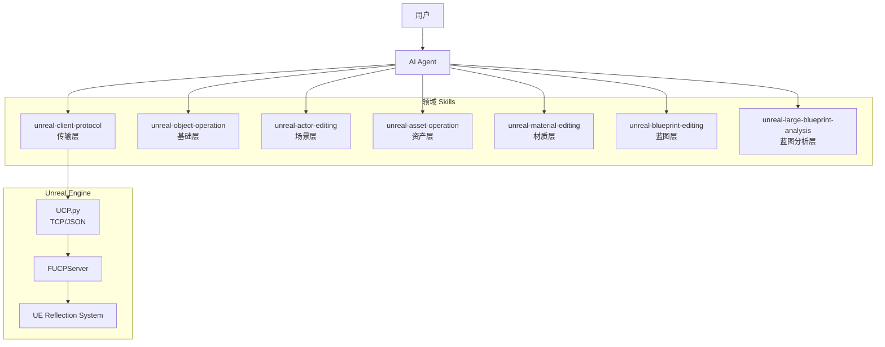
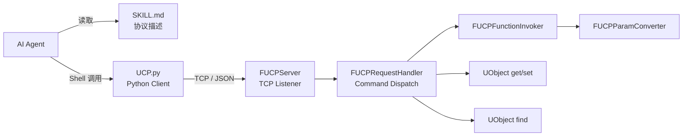
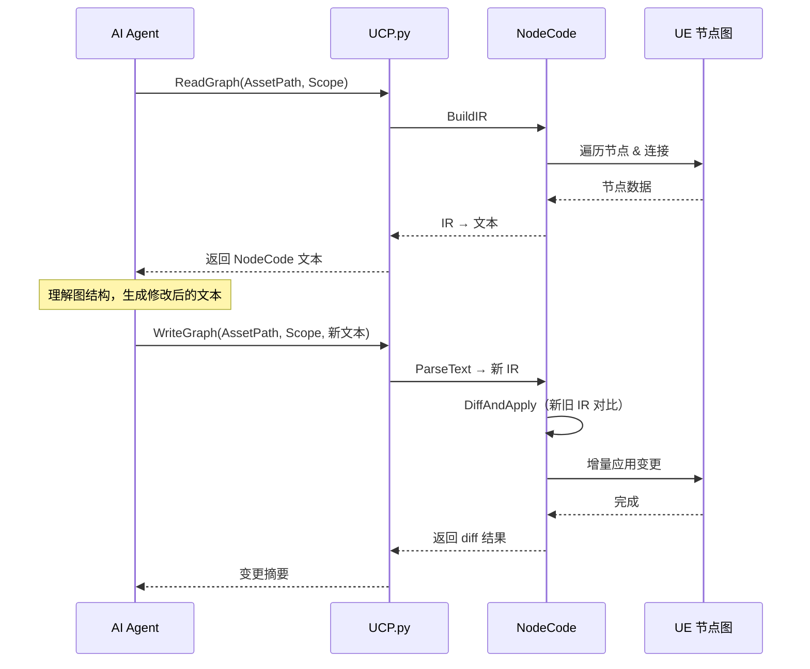
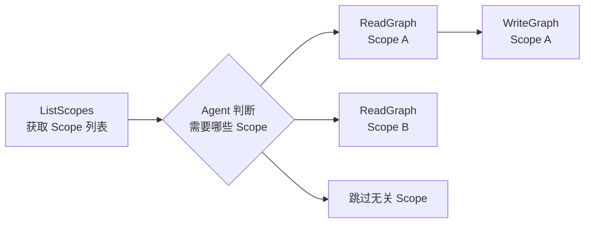
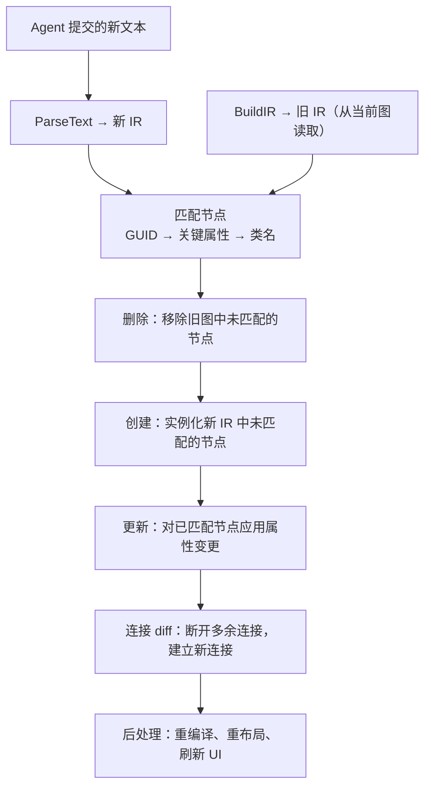
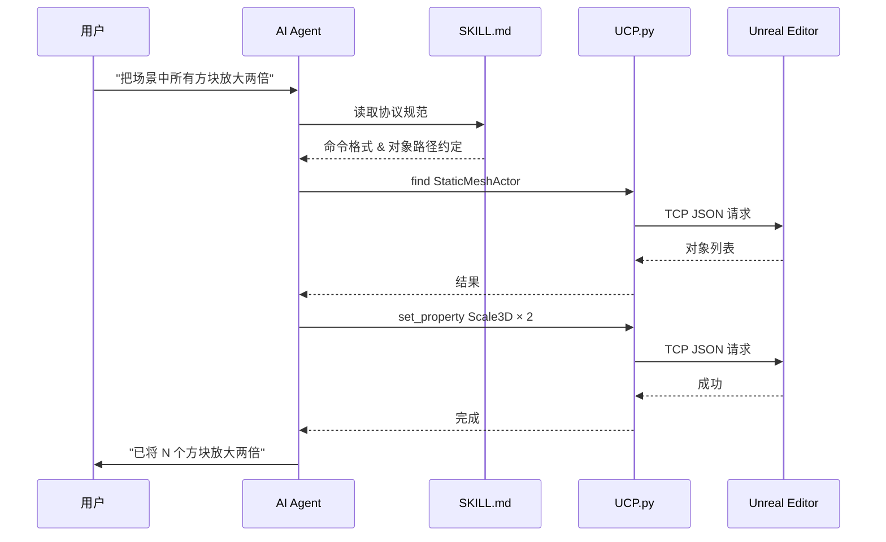

<p align="center">
  <h1 align="center">UnrealClientProtocol</h1>
  <p align="center">
    <strong>给你的 AI Agent 一双伸进 Unreal Engine 的手。</strong>
  </p>
</p>

UnrealClientProtocol（UCP）是一套面向 AI Agent 的原子化客户端通信协议。它的核心设计理念是：

- **不替 Agent 做决策，而是给它能力。**

传统的 UE 自动化方案往往需要为每个操作编写专门的接口或脚本。UCP 反其道而行——它只暴露引擎的原子能力（调用任意 UFunction、读写任意 UPROPERTY、查找对象、元数据自省），然后信任 AI Agent 自身对 Unreal Engine API 的理解来组合这些原子操作，完成任意复杂的任务。

这意味着：

- **你不需要预设"能做什么"。** Agent 能调用的不是一组有限的预定义命令，而是整个引擎反射系统暴露出的所有函数和属性——引擎能做的，Agent 就能做。
- **你可以用 Skills 来塑造 Agent 的行为。** 通过编写专属的 Skill 文件，你可以为特定工作流注入领域知识——关卡搭建的规范、资产命名的约定、材质制作的策略——Agent 会将这些知识与 UCP 协议结合，按照你定义的方式工作。
- **能力会随模型进化而增长。** UCP 的协议层是稳定的，而 Agent 的理解能力在持续提升。今天它可能需要 `describe` 来探索一个陌生的类，明天它也许已经了然于胸。你无需改动任何代码，就能享受到 AI 能力进步带来的红利。

## 为什么 AI Agent + 原子化协议 + 领域 Skills 能改变一切

### LLM 已经理解 Unreal Engine

试着问任何一个大语言模型——哪怕不是专门处理编程任务的模型——"UE 里怎么通过蓝图获取所有 Actor？准确的函数签名是什么？"，大部分 LLM 都能给出准确的回答：

```C++
static void UGameplayStatics::GetAllActorsOfClass(const UObject* WorldContextObject, TSubclassOf<AActor> ActorClass, TArray<AActor*>& OutActors)
```

这足以说明，**LLM 对 Unreal Engine 的知识储备已经非常深厚**，而这正是UCP的立足之点 —— 既然 LLM 已经熟悉Unreal Engine 的反射系统、了解常用模块的 API、知道蓝图节点背后对应的 C++ 函数，那我们约定一种格式简单的Json调用命令，让LLM生成，又有何难？

```json
{
  "object": "/Script/Engine.Default__GameplayStatics",
  "function": "GetAllActorsOfClass",
  "params": {
    "ActorClass": "/Game/Blueprints/BP_Enemy.BP_Enemy_C"
  }
}
```

UCP 本质上只提供了一项原子能力 — **通过Json调用虚幻引擎中任意的反射函数**

这在引擎侧只需要5步：

1. `FindTargetObject` — 根据路径定位目标 UObject
2. `FindTargetFunction` — 在对象上查找目标 UFunction
3. 根据 UFunction 的反射元数据构造参数 Buffer，借助 UE 原生的序列化机制将文本化参数写入对应的内存位置
4. `ProcessEvent` — 调用完成
5. 解析返回参数，回传给Agent

除了核心调用链，UCP 还提供了几项关键保障：

- **日志捕获**：自动拦截函数执行期间的引擎日志并返回给 Agent，便于诊断和自纠正。
- **事务安全**：属性修改自动纳入 Undo/Redo 系统，执行失败时 Agent 可回滚整个操作。
- **脚本聚合**：遇到可预知的复杂操作时，Skill 会引导 Agent 先生成 Python 脚本，再通过 `ExecutePythonScript` 一次性执行，大幅减少工具调用的往返次数。

但知识本身不等于能力，LLM 的"均衡"特性决定了它在没有引导时倾向于给出通用的、保守的回答——它知道怎么做，却不会主动去做。

而 UCP 做的事情很简单：

- **给它一双手（协议），加上一套行为规范（Skills），让已有的知识变成实际的行动。**

但需要特别说明的是，从一个 Demo 级别的效果到生产环境的工程化材质，中间的距离不在于协议能力，而在于 **领域经验** ，以材质为例：

- **工作流经验**：重复出现的逻辑应该抽象成材质函数；尽可能使用一个母材质覆盖更多变体，而不是为每个效果单独建材质。
- **效果制作经验**：场景、角色、特效、UI 各有不同的材质策略；一些经典手法（如 FlowMap、视差映射、距离场混合）有成熟的节点组合模式。
- **自反馈闭环**：Agent 应该能验证自己的输出——编译材质、检查指令数、比对预期效果——然后将成功经验沉淀为新的 Skill 知识。

这就是 Skill 的进化方向：**不是一次性写死的指令手册，而是一个持续积累、不断精炼的经验库。** 每一次成功的制作都可以回馈为更精准的 Skill 描述，让 Agent 下一次做得更好。

### Skill 记忆分层 —— 一个可持续进化的架构

Agent 社区正在兴起一种被称为"Skill"或"Memory"的记忆层策略，它通过将经验结构化为可检索的知识片段，大幅提升 AI 在特定领域的表现。

对于 Unreal Engine 来说，这种策略有着天然的适配性。UE 本身就是高度模块化的——渲染、物理、动画、UI、网络、音频——每个子系统都有独立的 API 体系和最佳实践。这意味着 Skill 的分层可以天然对齐 UE 的模块结构：

```
Skills/
├── unreal-client-protocol/            # 传输层：协议规范、调用方式
├── unreal-object-operation/           # 基础层：属性读写、对象查找、元数据
├── unreal-actor-editing/              # 场景层：Actor 生命周期管理
├── unreal-asset-operation/            # 资产层：搜索、依赖、CRUD
├── unreal-material-editing/           # 材质层：节点图、HLSL、材质实例
├── unreal-blueprint-editing/          # 蓝图层：蓝图节点图读写、函数/事件/变量编辑
├── unreal-large-blueprint-analysis/   # 蓝图分析层：大型蓝图系统化分析与 C++ 转译
├── unreal-animation/                  # (未来) 动画层
└── ...
```

随着功能的持续扩增，Skill 体系也会变得越来越庞大。但这并不构成问题——基于 UE 自身的代码结构和 LLM 对 UE 模块的理解，Skill 的记忆分层是可以系统化构建的。Agent 在执行任务时，只需加载与当前任务相关的 Skill 子集，而不是一次性读取全部知识。

更重要的是，**这是一个开放的、可社区协作的架构。** 任何开发者都可以为自己的工作流编写 Skill——一个技术美术可以贡献材质制作的经验，一个关卡设计师可以贡献场景搭建的规范，一个工具程序员可以贡献引擎扩展的模式——这些知识最终会汇入一个共享的 Skill 生态，让所有人受益。

## 特性

- **零侵入** — 纯插件架构，不修改引擎源码，拖入 `Plugins/` 即可使用
- **反射驱动** — 基于 UE 原生反射系统，自动发现所有 `UFunction` 与 `UPROPERTY`
- **极简协议** — 仅 `call` 一种命令，覆盖引擎中一切可反射的操作
- **编辑器集成** — 属性写入自动纳入 Undo/Redo 系统，操作可撤销
- **WorldContext 自动注入** — 无需手动传递 WorldContext 参数
- **安全可控** — 支持 Loopback 限制、类路径白名单、函数黑名单
- **开箱即用的 Python 客户端** — 附带轻量 CLI 脚本，一行命令即可与引擎对话
- **领域 Skill 生态** — 7 个专业 Skill 覆盖对象、Actor、资产、材质、蓝图操作，Agent 按需加载领域知识
- **多工具兼容** — Skill 描述文件兼容 Cursor / Claude Code / OpenCode 等主流 AI 编码工具

## Skill 生态

UCP 的协议层提供的是"原子能力"——调用函数、读写属性。而**领域 Skills** 将这些原子能力组织成特定领域的工作模式，让 Agent 在不同的任务场景下加载对应的专业知识。

当前已提供的 Skill：

| Skill | 层级 | 能力范围 |
|-------|------|---------|
| `unreal-client-protocol` | 传输层 | TCP/JSON 通信、`call` 命令协议、错误处理与自纠正 |
| `unreal-object-operation` | 基础层 | 任意 UObject 属性读写、元数据自省、实例查找、派生类发现、Undo/Redo |
| `unreal-actor-editing` | 场景层 | Actor 生成 / 删除 / 复制 / 移动 / 选择、关卡查询、视口控制 |
| `unreal-asset-operation` | 资产层 | AssetRegistry 搜索、依赖与引用分析、资产 CRUD、编辑器操作 |
| `unreal-material-editing` | 材质层 | 材质节点图文本化读写、Custom HLSL、材质实例编辑、编译与统计 |
| `unreal-blueprint-editing` | 蓝图层 | 蓝图节点图文本化读写、函数 / 事件 / 宏编辑、变量创建、自动编译 |
| `unreal-large-blueprint-analysis` | 蓝图分析层 | 大型蓝图（10+ 函数）系统化分析、C++ 转译、逻辑审计 |

每个 Skill 都是一个独立的 SKILL.md 文件，Agent 在接收到任务时按需读取。Skill 之间通过 UCP 协议层自然串联——比如创建一个材质需要 `unreal-asset-operation` 的资产创建能力 + `unreal-material-editing` 的节点图编辑能力 + `unreal-object-operation` 的属性设置能力，Agent 会自动组合多个 Skill 完成复合任务。

## 工作原理

### 架构总览



### 传输层细节



### NodeCode：节点图的文本化中间表示

对于材质和蓝图等可视化节点图，直接通过 `call` 逐个创建节点、设置属性、连接引脚既繁琐又容易出错。
UCP 引入了一套 Node Code 语法 — 它是一套**文本化中间表示（IR）**，让 AI 能像编辑代码一样编辑节点图。

NodeCode 将节点图编码为三个区段，基本格式如下：

```
=== scope: BaseColor ===

=== nodes ===
N0 MaterialExpressionScalarParameter {ParameterName:"Roughness", DefaultValue:0.5} #a1b2c3d4...
N1 MaterialExpressionMultiply #e5f6a7b8...

=== links ===
N0 -> N1.A
N1 -> [BaseColor]
```

- **节点行**：`N<索引> <类名> {属性} #<GUID>` — GUID 保证跨读写周期的稳定身份
- **连接行**：`N<源>.输出 -> N<目标>.输入` 或 `N<源> -> [图输出]`

#### AI 交互流程



#### 按需读取策略

一个复杂材质可能有数十个输出引脚和子图，一个蓝图可能包含多个函数和事件图。

将所有内容一次性序列化既浪费 Token 又会淹没上下文。

NodeCode 因此引入了 **Scope** 机制——Agent 先获取目录，再按需读取：



以材质为例，`ListScopes` 返回的是材质的所有输出引脚（`BaseColor`、`Roughness`、`Normal`...）和 Composite 子图。Agent 根据任务目标只读取相关的 Scope——修改粗糙度时只需 `ReadGraph("Roughness")`，无需加载整个材质图。写入时同样按 Scope 粒度提交，增量 diff 只影响该 Scope 内的节点，其余部分完全不受干扰。

#### 程序化处理：Diff & Apply

Agent 修改文本后，NodeCode 不会重建整个图，而是通过增量 diff 精确应用变更：



这种增量策略的优势在于：

- **最小化变更**：只修改实际变化的部分，不影响图中其他节点和连接
- **外部连接安全**：Scope 外的连接不会被触及
- **受保护节点**：FunctionEntry / FunctionResult 等关键节点不会被误删
- **自动后处理**：材质自动重编译，蓝图自动标记为需要编译

#### 支持的图类型

| 图类型 | API | Scope 模型 |
|--------|-----|-----------|
| 材质 | `UMaterialGraphEditingLibrary` | 材质输出引脚（BaseColor、Roughness...）或 `Composite:<名称>` 子图 |
| 蓝图 | `UBlueprintGraphEditingLibrary` | EventGraph、`Function:<函数名>`、`Macro:<宏名>` |

详细的格式规范和用法参见 [NodeCode 架构文档](Docs/NodeCode.md)。

## 快速开始

### 1. 安装插件

将 `UnrealClientProtocol` 文件夹复制到你的项目 `Plugins/` 目录下，重新启动编辑器编译即可。

### 2. 验证连接

编辑器启动后，插件会自动在 `127.0.0.1:9876` 上监听 TCP 连接。使用自带的 Python 客户端进行测试：

```bash
echo '{"object":"/Script/UnrealClientProtocol.Default__ObjectOperationLibrary","function":"FindObjectInstances","params":{"ClassName":"/Script/Engine.World"}}' | python Plugins/UnrealClientProtocol/Skills/unreal-client-protocol/scripts/UCP.py
```

如果返回了 World 对象列表，说明一切就绪。

### 3. 配置 Agent Skill

插件在 [`Skills/`](./Skills/) 目录下附带了完整的 Skill 包。你可以手动复制，也可以直接让 Agent 帮你完成安装。

**方式一：让 Agent 自行安装（推荐）**

直接向 Agent 发送以下指令：

> "把 `Plugins/UnrealClientProtocol/Skills/` 下的所有 Skill 文件夹复制到项目的 `.cursor/skills/` 目录下，并确保脚本能正确调用"

Agent 会自动完成文件复制，无需你手动操作。

**方式二：手动复制**

将 `Skills/` 目录下的**所有文件夹**复制到你所使用的 AI 编码工具的 Skills 目录中：

| 工具 | 目标路径 |
|------|----------|
| **Cursor** | `.cursor/skills/` |
| **Claude Code** | `.claude/skills/` |
| **OpenCode** | `.opencode/skills/` |
| **其他** | 参照对应工具的 Agent Skills 规范放置 |

复制后的目录结构如下：

```
.cursor/skills/                              # 或 .claude/skills/ 等
├── unreal-client-protocol/
│   ├── SKILL.md                             # 传输层协议描述
│   └── scripts/
│       └── UCP.py                           # Python 客户端
├── unreal-object-operation/
│   └── SKILL.md                             # 对象操作
├── unreal-actor-editing/
│   └── SKILL.md                             # Actor 操作
├── unreal-asset-operation/
│   └── SKILL.md                             # 资产操作
├── unreal-material-editing/
│   └── SKILL.md                             # 材质操作
├── unreal-blueprint-editing/
│   └── SKILL.md                             # 蓝图编辑
└── unreal-large-blueprint-analysis/
    └── SKILL.md                             # 大型蓝图分析
```

**解决脚本执行策略问题（Windows）**

在 Windows 上，PowerShell 默认的执行策略可能会阻止 Agent 运行 Python 脚本。如果遇到 "cannot be loaded because running scripts is disabled on this system" 错误，以**管理员身份**打开 PowerShell 并执行：

```powershell
Set-ExecutionPolicy RemoteSigned -Scope CurrentUser
```

或者，你同样可以直接让 Agent 帮你执行这条命令来解决。

完成后，Agent 在接收到与 Unreal Engine 相关的指令时，会自动读取 SKILL.md 并通过 `scripts/UCP.py` 与编辑器通信。

> **工作流程**：用户发出指令 → Agent 识别并读取 SKILL.md → 根据协议构建 JSON 命令 → 通过 `UCP.py` 发送给编辑器 → 返回结果



### 4. 验证 Agent 功能

向 Agent 发出以下测试指令，确认 Skill 配置正确：

- **查询场景**："帮我看一下当前场景都有什么东西"
- **读取属性**："现在的太阳光对应真实世界的什么时间"
- **修改属性**："把时间更新到下午六点"
- **调用函数**："调用 GetPlatformUserName 看一下当前用户名"
- ...

如果 Agent 能够自动构建正确的 JSON 命令、调用 `UCP.py` 并返回结果，说明一切配置完成。

## 配置项

通过 **编辑器 → 项目设置 → 插件 → UCP** 进行配置：

| 设置 | 类型 | 默认值 | 说明 |
|------|------|--------|------|
| `bEnabled` | bool | `true` | 启用/禁用插件 |
| `Port` | int32 | `9876` | TCP 监听端口（1024–65535） |
| `bLoopbackOnly` | bool | `true` | 仅绑定 127.0.0.1 |
| `AllowedClassPrefixes` | TArray\<FString\> | 空 | 类路径白名单前缀，为空则不限制 |
| `BlockedFunctions` | TArray\<FString\> | 空 | 函数黑名单，支持 `ClassName::FunctionName` 格式 |


## 已知限制

- **Latent 函数**（包含 `FLatentActionInfo` 参数）不受支持
- **委托（Delegate）** 不支持作为参数传递

## Roadmap

- [x] 原子化协议（call / 反射驱动）
- [x] 对象操作（属性读写、元数据自省、实例查找、Undo/Redo）
- [x] Actor 操作（生成、删除、复制、选择、变换）
- [x] 资产管理（AssetRegistry 搜索、依赖分析、CRUD、编辑器操作）
- [x] 材质文本化（节点图读写、Custom HLSL、材质实例编辑）
- [x] 蓝图文本化（节点图读写、函数 / 事件 / 宏编辑、大型蓝图分析与 C++ 转译）
- [ ] Widget文本化
- [ ] Niagara文本化
- [ ] 视觉感知（截图 / 预览反馈，让 Agent 能"看到"自己的操作结果）
- [ ] Skill 记忆分层与自反馈（经验沉淀、效果自验证、知识持续积累）
