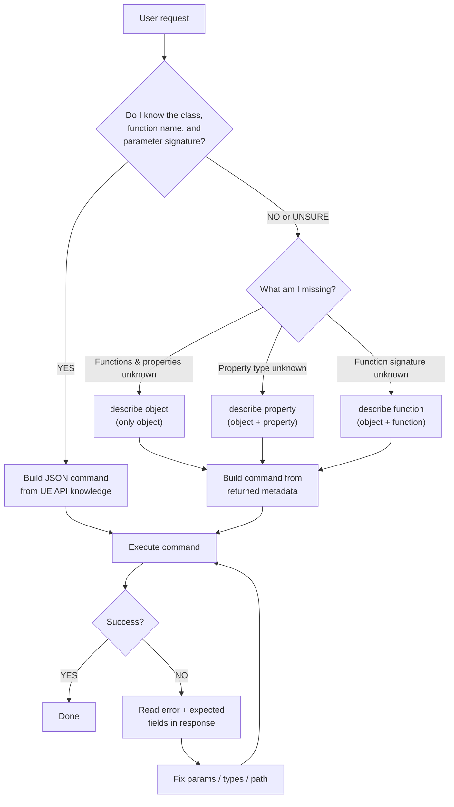

# UnrealClientProtocol

Communicate with a running UE editor through the UnrealClientProtocol TCP plugin.

## Invocation

```bash
python scripts/UCP.py '<JSON>'
```

`<JSON>` can be a **single command** (object) or **batch** (array of objects).

## Core Principle — "Knowledge First, Describe to Verify"

You (the AI) already possess extensive knowledge of the Unreal Engine C++ / Blueprint API. **Always leverage that knowledge to construct commands directly**. Do NOT call `describe` before every operation — treat it as a diagnostic tool, not a prerequisite.

### Decision Flow



### Key Rules

1. **Construct from knowledge first.** You know that `KismetSystemLibrary::PrintString` takes `InString(FString)`, `bPrintToScreen(bool)`, etc. Just call it.
2. **Batch aggressively.** Group multiple independent commands into one JSON array to reduce round-trips.
3. **Use `describe` only when uncertain.** For example, a project-specific Blueprint class whose API you cannot know in advance.
4. **Read error responses carefully.** A failed `call` returns `{"error":"...", "expected":{...}}` — the `expected` field is the actual function signature. Use it to self-correct without an extra `describe` round-trip.
5. **WorldContext is auto-injected.** Never pass `WorldContextObject` manually — the plugin fills it automatically for functions with the `WorldContext` meta.
6. **Latent functions are not supported.** Functions with `FLatentActionInfo` parameter (e.g. `Delay`, `MoveComponentTo`) will be rejected. Use alternative approaches.

## Commands

### call — Call a UFunction

```json
{"type":"call","object":"<object_path>","function":"<func_name>","params":{...}}
```

- `object`: Full UObject path — use CDO path for static/library functions, instance path for member methods.
- `function`: The UFunction name exactly as declared in C++ (e.g. `"PrintString"`, not `"Print String"`).
- `params`: (optional) Map of parameter name → value. UObject* params accept path strings. Omit `WorldContextObject`.

**How to determine params from your knowledge:**

Look up the C++ signature you already know. For example, `UKismetSystemLibrary::DrawDebugLine`:

```cpp
static void DrawDebugLine(const UObject* WorldContextObject, FVector LineStart, FVector LineEnd, FLinearColor LineColor, ...);
```

Translate to JSON: skip `WorldContextObject` (auto-injected), map struct types to JSON objects:

```json
{
  "type": "call",
  "object": "/Script/Engine.Default__KismetSystemLibrary",
  "function": "DrawDebugLine",
  "params": {
    "LineStart": {"X":0,"Y":0,"Z":0},
    "LineEnd": {"X":100,"Y":0,"Z":0},
    "LineColor": {"R":1,"G":0,"B":0,"A":1}
  }
}
```

### get_property — Read a UPROPERTY

```json
{"type":"get_property","object":"<object_path>","property":"<prop_name>"}
```

Property name is the C++ field name (e.g. `"RelativeLocation"`, `"StaticMesh"`).

### set_property — Write a UPROPERTY (supports Undo)

```json
{"type":"set_property","object":"<object_path>","property":"<prop_name>","value":<json_value>}
```

Value format matches the property type:
- `FVector` → `{"X":1,"Y":2,"Z":3}`
- `FRotator` → `{"Pitch":0,"Yaw":90,"Roll":0}`
- `FLinearColor` → `{"R":1,"G":0.5,"B":0,"A":1}`
- `FString` → `"hello"`
- `bool` → `true` / `false`
- `UObject*` → `"/Game/Path/To/Asset.Asset"`

### describe — Introspect metadata (3 modes)

Use this when you are **unsure** about an object's API. Do NOT use it routinely for known engine classes.

**Mode 1: Object metadata** — returns class info, property list, function list.
```json
{"type":"describe","object":"<object_path>"}
```

**Mode 2: Property metadata** — returns type, flags, current value.
```json
{"type":"describe","object":"<object_path>","property":"<prop_name>"}
```

**Mode 3: Function metadata** — returns full parameter signature.
```json
{"type":"describe","object":"<object_path>","function":"<func_name>"}
```

### find — Find UObject instances by class

```json
{"type":"find","class":"<class_path>","limit":100}
```

## Object Path Conventions

| Kind | Pattern | Example |
|------|---------|---------|
| Static/CDO | `/Script/<Module>.Default__<Class>` | `/Script/Engine.Default__KismetSystemLibrary` |
| Instance | `/Game/Maps/<Level>.<Level>:PersistentLevel.<Actor>` | `/Game/Maps/Main.Main:PersistentLevel.BP_Hero_C_0` |
| Class (for find) | `/Script/<Module>.<Class>` | `/Script/Engine.StaticMeshActor` |

**How to determine the module name:** The module usually matches the C++ module that defines the class. Common ones:
- `Engine` — AActor, UStaticMeshComponent, UWorld, UKismetSystemLibrary, UGameplayStatics, ...
- `UnrealEd` — UEditorActorSubsystem, UEditorAssetLibrary, UEditorLevelLibrary, ...
- `Foliage`, `Landscape`, `UMG`, `Niagara`, etc. — domain-specific classes.

## Batch Execution

```bash
python scripts/UCP.py '[{"type":"find","class":"/Script/Engine.World","limit":3},{"type":"describe","object":"/Script/Engine.Default__KismetSystemLibrary"}]'
```

For large payloads, pipe via stdin:

```bash
echo '<JSON>' | python scripts/UCP.py --stdin
```

## Common Patterns

### Discover actors in the scene

```json
[
  {"type":"find","class":"/Script/Engine.StaticMeshActor","limit":50},
  {"type":"find","class":"/Script/Engine.PointLight","limit":20}
]
```

### Get and modify an actor's transform

```json
[
  {"type":"get_property","object":"<actor_path>","property":"RelativeLocation"},
  {"type":"set_property","object":"<actor_path>","property":"RelativeLocation","value":{"X":100,"Y":200,"Z":0}}
]
```

### Call an Editor Subsystem function

```json
{
  "type": "call",
  "object": "/Script/UnrealEd.Default__EditorActorSubsystem",
  "function": "GetAllLevelActors"
}
```

### Explore an unfamiliar Blueprint class

```json
{"type":"describe","object":"/Game/Maps/Main.Main:PersistentLevel.BP_CustomActor_C_0"}
```

Then use the returned property/function lists to construct subsequent commands.

## Error Recovery Strategy

1. **`call` fails** → Read `error` and `expected` from the response. The `expected` field contains the actual function signature. Correct your params and retry.
2. **Object not found** → Verify the path. Use `find` to locate instances, or check the module name in the CDO path.
3. **Property not found** → The property name may differ from the Blueprint display name. Use `describe` on the object to see available properties.
4. **Connection refused** → The editor is not running or the plugin is disabled. Ask the user to check.

## Response Format

- **Success**: Returns the result value directly, no wrapper. e.g. `find` returns `{"objects":[...],"count":3}`
- **Failure**: Returns `{"error":"...", "expected":{...}}` where `expected` contains the function signature (`call` only)
- **Batch**: Returns an array, each element simplified independently
- **Connection failure**: Returns `{"error":"Cannot connect to UE (...)"}`
